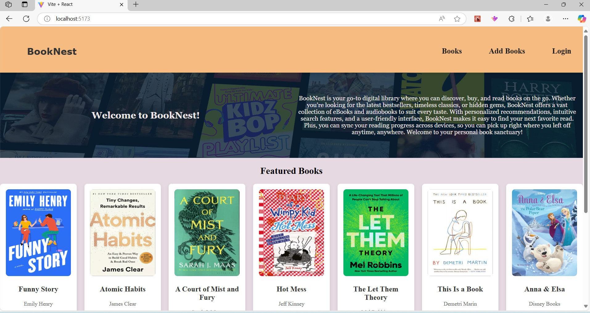
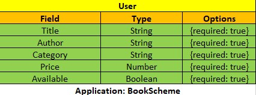

# APPLICATION NAME/APPLICATION TITLE
BookNest

##BackEnd repository link
[Github.com] 
*           (https://github.com/Sahithi1101/Capstone-Project-BE) -BackEnd

#### INSERT 1 SENTANCE SUMMARY OF YOUR APPLICATION
The bookstore app is a digital platform for browsing, searching and adding books. 
It features an easy-to-use interface, various book categories, personalized recommendations,, 
and social sharing options. This app aims to provide users with a convenient and enjoyable reading 
experience.

## Description
BookNest is a bookstore app where you can discover, buy, and read books on the go. 
Whether you’re looking for the latest bestsellers, timeless classics, or hidden gems, BookNest offers a 
vast collection of eBooks and audiobooks to suit every taste. With personalized recommendations, 
intuitive search features, and a user-friendly interface, BookNest makes it easy to find your next favorite read. 
Plus, you can sync your reading progress across devices, so you can pick up right where you left off anytime, anywhere. 
Welcome to your personal book sanctuary!

## Table of Contents
* [Technologies Used](#technologiesused)
* [Features](#features)
* [Design](#design)
* [Project Next Steps](#nextsteps)
* [Deployed App](#deployment)
* [About the Author](#author)

## Technologies Used
* MongoDB
* Express
* React
* Nodejs
* JavaScript
* CSS3

## Features
[Users are able to...]
Here’s a concise summary of the key features of a bookstore app:
Login: where the user logins in to the app
Search & Filters: user searchs for the books with either the title or the author name.
Book Details: user gets the datails of the books like title, author, category, price and the availability of the books
Add books: user can add the books to the database.

## Design
* My Kids love to read books, from that i had the idea to build the bookstore app called BookNest. Ex: Design elements implemented using HTML5 and CSS3. 

## ERD Images & DB Structure
* Embeded ERD Images
* 
* 
* 
* 
* 
* 
* 
* 
* 
* 
* 

 ##My Database Schema
title: { type: String, required: true }, 
author: { type: String, required: true }, 
category: { type: String, required: true }, 
price: { type: Number, required: true }, 
available: { type: Boolean, required: true },
 
#Sample data
{"title": "The Great Gatsby"
 "author":"F. Scott Fitzgerald"
 "category":"Fiction"
 "price": "21.99"
 "available": "true"}

## Project Next Steps
#### List of Future Features
* Add the shopping cart.
* Add ereading.
* Add a timer for reading

* You can view the repository:
[Github.com]
*           (https://github.com/Sahithi1101/Capstone-Project-FE)-FrontEnd
*           (https://github.com/Sahithi1101/Capstone-Project-BE)-BackEnd

## About The Author
I build applications and mini projects tied to my various interests. I look for creative solutions to real world problems and think of technical ways to address them. While no application is ever perfect I find joy in the process and all my final products!

## Special Mention: Supporters of the build
* Swetha Malasani
* [LinkedIn]
* (https://www.linkedin.com/in/swetha-malasani-943652338/)
